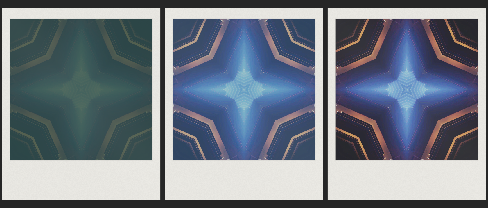
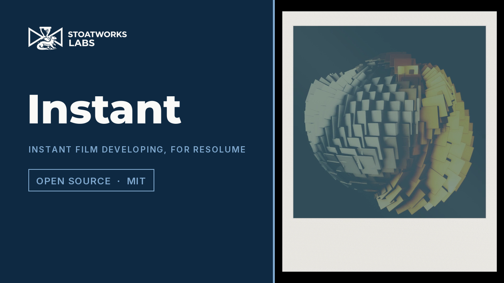

# instant

> **AI-assisted project.** This codebase was created with [Claude](https://claude.com/claude-code)
> (Anthropic), directed and reviewed by a human author. The print is not asserted but
> measured: an offline harness drives the real plugin class in a headless GL context
> on a synthetic clock and reads each claim back out of the picture — each dye layer's
> density on a flat patch follows its first-order law with the stated time constant,
> fitted without knowing the asymptote; at the stated early time the cyan layer leads
> and the print then moves only toward neutral, reaching it at the stop; the time
> constants at 14 and 34 °C stand in the ratio the Arrhenius law gives, for each dye
> layer at its own activation energy and for the timing layer; a neutral grey comes out
> green when cold, neutral at 24 °C and warm when hot; each row of the print starts developing at its
> distance from the pod edge over the front's speed; the dirty roller's mark repeats
> at exactly its circumference, whole-pixel and fractional; after a Take the print
> develops from the captured frame however the clip changes, and a resize keeps it;
> and the camera's meter prints two levels alike — with nine negative controls that
> prove each check can fail. It has **never been loaded into Resolume**; it is loaded
> by [oxbow](https://github.com/stoatworks-labs/oxbow), which is a real FFGL host and
> is not Resolume. See [Status](#status).

Instant film developing in front of you — an integral print, exposed by a Take and
coming up over minutes — as an FFGL effect for [Resolume](https://resolume.com) Arena
and Avenue.



<sub>One print, rendered by `intest --pipe`, the offline harness — not captured from
Resolume. Resolume's bundled demo clip at the defaults, half a second, two seconds and
eleven seconds after the take, at 64x.</sub>

<!-- downloads:start -->

## Download

**[v0.1.0](https://github.com/stoatworks-labs/instant/releases/tag/v0.1.0)** — prebuilt for macOS and Windows. Pick your platform:

<details>
<summary><b>macOS</b> — Universal (Apple Silicon + Intel)</summary>

| Build | Download | Size |
| --- | --- | --- |
| Universal (Apple Silicon + Intel) · .dmg disk image | [`instant-0.1.0-macos-universal.dmg`](https://github.com/stoatworks-labs/instant/releases/download/v0.1.0/instant-0.1.0-macos-universal.dmg) | 217 KB |
| Universal (Apple Silicon + Intel) · .zip archive | [`instant-macos-universal.zip`](https://github.com/stoatworks-labs/instant/releases/latest/download/instant-macos-universal.zip) | 178 KB |

</details>

<details>
<summary><b>Windows</b> — x64</summary>

| Build | Download | Size |
| --- | --- | --- |
| x64 · .exe installer | [`instant-0.1.0-windows-x86_64-setup.exe`](https://github.com/stoatworks-labs/instant/releases/download/v0.1.0/instant-0.1.0-windows-x86_64-setup.exe) | 223 KB |
| x64 · .zip archive | [`instant-windows-x86_64.zip`](https://github.com/stoatworks-labs/instant/releases/latest/download/instant-windows-x86_64.zip) | 114 KB |

</details>

All builds, checksums and release notes: [github.com/stoatworks-labs/instant/releases](https://github.com/stoatworks-labs/instant/releases).

macOS builds are signed and notarised and open normally. The Windows builds are unsigned, so SmartScreen warns once.

<!-- downloads:end -->

## Video

[](https://www.youtube.com/watch?v=nUx-UvWsWgQ)

Every beat runs in real time at the Speed its caption states: 64x (the default), 1x (real
time, for seven seconds), 128x and 256x. A real print takes about ten minutes.

## The one idea

An integral instant print — the kind a Polaroid SX-70 or 600 camera ejects — is
exposed through its front, and then it develops in the open, in the order the
chemistry sets. The camera's rollers burst a reagent pod in the print's thick bottom
border and spread it up the frame. Dye developers migrate from the negative's three
layers to the image layer, each at its own rate, under a dark opacifier that shields
the negative until a timing layer drops the pH — which also ends development.

So the picture comes up from a dark green-grey, pale and blue-cyan at first, and warms
to full colour as the slower magenta and yellow dyes arrive. This plugin runs that
process on the clip's frame, stage by stage, on the host's clock.

## What falls out

None of these is drawn. Each is one stage of the print doing what it does:

- **The picture arrives blue-cyan and warms.** Each dye layer approaches its final
  density first-order, cyan with a time constant of 70 s, magenta 120 s, yellow
  200 s. Four minutes in, a neutral grey reads density R 0.67, G 0.60, B 0.51.
- **The dark green-grey start** is the opacifier, clearing with its own time constant.
- **Temperature changes the picture, not only the speed.** Every rate follows the
  Arrhenius law, and each dye layer has its own activation energy. The timing layer
  that ends development speeds up less than the dyes do, so cold film stops short —
  pale, low in contrast, and **green**, because magenta slows the most and is cut
  shortest — and hot film finishes, with the slow yellow over-reaching: warm, yellow-red.
  That is what the manufacturer's support page says of cold and hot prints.
- **The print develops bottom-first**, from the pod edge, at the front's speed. The
  harness measures it row by row; the eye cannot see it at any `Speed`, because the front
  crosses the frame in one film-second and the picture takes a minute to come through.
- **A short spread leaves the top corners dark**, where no reagent reached; `Uneven`
  runs in lanes; `Expired` paste reaches less far, and the dyes fade toward pink.
- **A dirty roller repeats its mark** at exactly its circumference.
- **The camera meters.** An averaging meter brings the frame's mean to mid grey at the
  take, within a camera's range; `Exposure` is the lighten/darken wheel on top.

### The honest limit

Most of the chemistry's numbers are assumptions, and the plugin says so beside each
one. The yellow layer's activation energy is fitted from ILFORD's chart for
black-and-white silver development, and applying it to dye development is itself an
assumption. **The cyan and magenta layers' (103.6 and 106.85 kJ/mol) are fitted to the
manufacturer's description of a cold print** — a green tint — not to any measurement:
no published per-layer figure was found. The timing layer's is taken as half the
chart's, with no source. The dye time constants, the stop and
the opacifier are chosen to land inside the manufacturer's stated 10–15 minutes and
the order the process is known for. None of them was measured from a real print. Each
dye absorbs only its own channel, and the spread is a straight front with a stated
reach, not a fluid.

## Controls

| Group | |
| --- | --- |
| **Film** | Film (Colour, Black & White, Vintage), Temperature (4–36 °C), Expired. |
| **Exposure** | Take (event), Mode (Take, Continuous), Interval (0.5–128 s), Exposure (±2 stops on the meter). |
| **Chemistry** | Spread (Full, Short, Uneven), Dirty Roller, Speed (1–256×). |
| **Print** | Border (full frame to the print in its frame), Mix. |

The defaults are colour film at 24 °C, fresh, a full spread and a clean roller, the
print in its frame, a new print every 16 s, at **64×**. That brings a picture up in
about a second and ends development 9.4 s after the take. **1× is honest**: a real
print, ten minutes to the stop. In Take mode the plugin shows the clip until you press
Take. Outside the print the output is transparent, so a print floats over the layer
below; set Border to 0 for the process full-frame.

## Status

**v0.1.1, released 25 September 2026, and honestly early.** v0.1.1 turns the cold
print's cast from cyan to green, as the manufacturer describes it, by giving each dye
layer its own activation energy; v0.1.0 came out the same day. There is a
[user guide](https://stoatworks-labs.com/software/instant/guide/)
([PDF](docs/USER-GUIDE.pdf)) and a [project page](https://stoatworks-labs.com/software/instant/).

### Measured offline, on macOS

`tools/verify.sh` passes on this machine (M4 Max, macOS 26.4.1) against a fresh
universal Release build. It runs every check at **two rasters**, 320×180 and 1280×720,
and again at 320×180 on Apple's software renderer. In numbers:

| check | result |
| --- | --- |
| `--develop` | cyan, magenta, yellow τ **70.0000, 120.0004, 200.0016 s** against 70, 120, 200; every successive difference on its first-order line; black-and-white 90.0000 s; the opacifier 44.9997 s against 45 |
| `--order` | at 240 s density R 0.676 > G 0.607 > B 0.516, a blue-cyan print; the balance falls on all 46 steps after, to **3e-7** past the stop |
| `--arrhenius` | τ(14 °C) / τ(34 °C) for each dye at its own activation energy: cyan **16.8696** against 16.8695 at 103.6 kJ/mol, magenta **18.4332** against 18.4330 at 106.85, yellow **6.2871** against 6.2870 at 67.41; the opacifier 2.50736 against 2.50739 |
| `--cast` | a neutral grey after the stop, out of the picture: at 4, 6 and 12 °C **green**, G above R by 0.15, 0.15, 0.11 and above B by 0.18, 0.15, 0.06 in density (margin 0.02); at 24 °C neutral to **1e-7**; at 30, 34 and 36 °C **warm**, R above B by 0.022, 0.029, 0.031 (margin 0.02) |
| `--front` | every row began developing at distance / front speed to **4.5e-6 s** (tolerance 6.8e-5); the speed out of the picture 1.000001 image heights / s |
| `--roller` | whole-pixel (55 and 225 px): the print translates onto itself **exactly** one circumference on; fractional (56.25 and 226.25 px): mark centroids within 0.028 px of stated (bound 1/(8w) = 0.097) |
| `--take` | the print is identical whether or not the clip changes after the take; resized to 1.5× and back mid-development, the same to **2e-7** |
| `--meter` | two patch levels print the same to 6e-8, at the stated density of metered mid grey; one past the camera's +3 stops prints darker, as stated |
| `--negative` | nine perturbed models — one τ for all layers, the front everywhere at once, no temperature law, cyan's τ × 1.1, the roller 2% large, a resize that clears, a capture that follows the clip, no meter, and v0.1.0's one activation energy for every dye (which prints the cold grey blue-cyan) — each **fails** its check |
| mutation | v0.1.0: one character of the shipped GLSL (`StopDose - dose.y` → `StopDose + dose.y`: development never stops) was caught by `--order` and `--meter`. v0.1.1: `dose.xyz` → `dose.xxz` in the print pass (magenta developing on cyan's dose) was caught by `--arrhenius` alone. Both reverted |
| `tools/sweep.py` | all **12** controls measurably change the picture (Take under Take mode) |
| shaders | all six stages, as the plugin assembles them, compile through `glslc`; no GLSL 4.10 reserved word as an identifier |
| activation energies | yellow's refits from the chart's 40 cells to the committed 67410 J/mol; cyan's and magenta's refit from the cold-green conditions to the committed 103600 and 106850 |
| `--pipe` | 2.5 frames in, exactly 2 out; an unknown cue refused; a closed stdout and a failed render exit 1; an option cue steps, an event cue fires on its frame |
| the bundle | universal (`x86_64 arm64`), exports `plugMain`, ad-hoc signs; `oxbow` reports `SW Instant` / `IN01` / `effect` and renders 120 frames through `plugMain` |

Render cost at the defaults, best of three runs of 60 frames after a warm-up,
`glFinish` both sides, on a GPU shared with other work: **0.09 ms** at 720p,
**0.16 ms** at 1080p, **0.64 ms** at 4K (v0.1.1; v0.1.0 measured 0.05, 0.07 and 0.37 on
a quieter GPU). State held across frames: the capture and two development buffers,
40 bytes a texel since v0.1.1 (three dye doses and the stop): **35 MB** at 720p,
**79 MB** at 1080p, **316 MB** at 4K. macOS figures only.

### In Resolume Arena, on Windows

On Windows it has: the v0.1.1 build loads, registers and renders in Resolume Arena 7.27.1 on software rendering (win-lab, Mesa llvmpipe, no GPU), with all 18 host controls matching what the plugin declares, in the fleet's Arena gate (9 of 9 checks, 2026-09-25). The gate's picture is a still: eight controls read as moving the picture, Temperature and Speed inconclusive (Speed acts only while a print develops, and the gate's print is finished 9.4 s after its take; Temperature read weakly live on v0.1.0's run, and the gate's thumbnail served the bare clip on five grabs this time), and Mode and Interval were not measured, because they act only at the next take and the next print of a still is the same print. Software rendering says nothing about a GPU or about speed.

### What filming the release video found

The video is rendered through `intest --pipe` over Resolume's demo clips, every beat in real
time at the Speed its caption states. It found that **the reagent front cannot be seen** at any
Speed (it crosses the frame in one film-second, and the picture takes a minute to come through
the opacifier: at 1× the bottom of a flat grey leads the top by a level or two, less than the
shine), so the video shows seven seconds of real time instead and makes no claim for the front.
It also measured the casts on a mid grey after the stop: 6 °C printed (119, 128, 139), clearly
blue-cyan; 34 °C (117, 116, 112), only slightly warm. That cold cyan is what v0.1.1 changed; the
video was not re-filmed: its 6 °C beat (at 0:29) still shows v0.1.0's cyan, and its caption
says so.

### The cold print is green, since v0.1.1

The manufacturer's support page on temperature (read through the Internet Archive's copies of
2023-02 and 2026-04) says prints below 13 °C come out over-exposed, lacking colour contrast and
**with a green tint**, and above 28 °C colour prints take a yellow/red tint. v0.1.0 printed the
cold grey blue-cyan: the build session had the page only through search summaries that said
cyan. v0.1.1 gives each dye layer its own activation energy, so the cold slows magenta most, and
the cold grey is green. Through the plugin, a flat mid grey at the defaults, printed at 256x,
after the stop, 8-bit:

| | v0.1.0 | v0.1.1 |
| --- | --- | --- |
| 4 °C | 124, 134, 146 | **151, 176, 146** |
| 6 °C | 123, 131, 142 | **143, 167, 142** |
| 14 °C | 121, 124, 129 | 124, 135, 129 |
| 24 °C | 120, 120, 119 | 120, 120, 119 |
| 34 °C | 120, 120, 116 | 120, 120, 116 |

The page gives no numbers and no published per-layer figure was found, so the cyan and magenta
activation energies are **fitted to its words** (`tools/cast_fit.py`): at 6 °C red equals blue,
and the cast is as strong as v0.1.0's was. At 24 °C nothing changed.

### Not done

- **Never loaded into Resolume on macOS.** Everything above was compiled, rendered and
  measured offline against the real plugin class in a headless CGL context, plus an `oxbow`
  load.
- Seen only on Resolume's bundled demo clips through `intest --pipe`, never on camera footage.
- `--cast` checks the hue of Temperature's casts on a neutral grey; how strong they are, and
  the casts Expired and Vintage produce, are judged by eye.
- No OpenFX port and no presets.

## Browser demo

[instant-demo.stoatworks-labs.com](https://instant-demo.stoatworks-labs.com/) runs the
plugin's own capture, meter, develop, resample and print shaders in WebGL2, spliced in
from `source/Shaders.cpp` by `demo/tools/sync_shaders.py` with the constants block the
plugin writes from `Model.h`, and checked by `demo/tools/check_shaders.py` from
`tools/verify.sh` against what `intest --dump-shaders` says the plugin compiles. So the
camera's meter, the dye and stop doses and the print run on the GPU over the same float
buffers. Its CPU half — the clock and the film age, the take, the Arrhenius factors, the
print's layout and every control's law — is a hand port to JavaScript that only a reader
checks, and the page says so. Driven frame by frame against `intest --pipe --fps 60` on
the same input it agrees to 1/255 on every pixel. Take is a button under the picture.
Generated clips only, or your own image or video, which never leaves the page.

## Build

Needs CMake 3.15+, a C++17 compiler, and the FFGL SDK submodule.

```bash
git clone --recursive https://github.com/stoatworks-labs/instant
cd instant
cmake -B build -DCMAKE_BUILD_TYPE=Release
cmake --build build --parallel
cmake --install build     # into ~/Documents/Resolume Arena/Extra Effects
```

macOS builds are universal (Apple Silicon + Intel) by default; add
`-DCMAKE_OSX_ARCHITECTURES=arm64` for a faster dev build. Windows needs GLEW via vcpkg.

## Building and testing

The offline harness renders the real plugin class headlessly, on a synthetic 60 fps
clock:

```bash
./build/intest --out /tmp/frame.png --size 1920x1080   # the moving card
./build/intest --list                                  # every control, kind and default
./build/intest --develop --order --arrhenius           # each claim, measured
./build/intest --front --roller --take --meter
./build/intest --negative                              # and the checks can fail
./build/intest --bench                                 # 720p, 1080p, 4K, and the state held
python3 tools/sweep.py                                 # no control is silently dead
python3 tools/arrhenius_fit.py --check                 # the activation energy refits
tools/verify.sh                                        # all of it, on a fresh universal build
```

Every check takes `--size`; run it at 320×180 as well as the raster you care about.
Footage goes through the real shaders with `--pipe`, in the fleet's frame format:

```bash
ffmpeg -i in.mov -f rawvideo -pix_fmt rgba - \
  | ./build/intest --pipe --size 1920x1080 --fps 30 --script cues.txt \
  | ffmpeg -f rawvideo -pix_fmt rgba -s 1920x1080 -i - out.mov
```

See [`CLAUDE.md`](CLAUDE.md) for the full command reference and
[`AGENTS.md`](AGENTS.md) for the model, where each number comes from, and the traps.

<!-- attributions:start -->
This project is built on other people's work — see [ATTRIBUTIONS.md](ATTRIBUTIONS.md).
<!-- attributions:end -->

## Licence

MIT — see [LICENSE](LICENSE).
